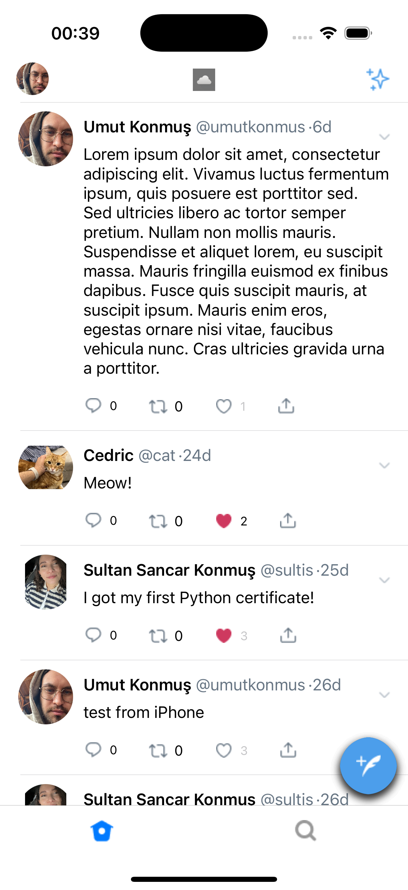

# GraySky
This project is the Swift code for the GraySky application. It is an application 
(developed mainly to learn and experiment with UIKit) to share their daily thoughts.

## Getting Started
### Tech Stack 
- Swift
- UIKit
- Storyboard
- Auto Layout
- Google Firebase
- API Call
- Delegation Pattern
- MVVM

### Prerequisites

- Xcode 16.2+
- Swift 5.0+

### Installation
## 1. Create a Firebase Project

First, you need to create a Firebase project. Follow the steps below:

1. Go to the [Firebase Console](https://console.firebase.google.com/).
2. Click the **"Add Project"** button at the top-right corner.
3. Give your project a name and proceed.
4. Choose any additional options Firebase offers based on your needs (for example, enable Google Analytics).
5. Once the project is created, you will be redirected to the Firebase Console homepage.

## 2. Set Up Firebase Structure

After creating your Firebase project, you must set up the following structure in Firebase's Firestore database. You can do this using Firestore.

### Firestore Structure:
```plaintext
- /Entries
  - {userId} (document)
    - date: "dateField" (timestamp)
    - likedBy: ["likedUID"] (array)
    - publisherUID: "userId" (string)
    - text: "EntryText" (string)
- /UserImages
  - {userId} (document)
    - username: "John Doe"
    - imageUrl: "Firestore Image URL"
```

## Explanation

The **/entries** collection will contain individual documents for each entry (like a post).

Each **entry** document will contain the following fields:

- **date**: The date when the entry was posted (stored as a **Timestamp** in Firestore).
- **likedBy**: An array containing the user IDs of people who liked the entry.
- **publisherUID**: The publisher's user ID.
- **text**: The content of the post (a string).


## 3. Configure Firebase Security Rules

It is crucial to correctly configure Firebase Firestore security rules to protect your data. To ensure that only authenticated users can read and write to your database, configure the security rules as follows:

1. Open **Firestore Database** in the Firebase Console.
2. In the left menu, click the **Rules** tab.
3. Paste the following security rules:
```plaintext
rules_version = '2';

service cloud.firestore {
  match /databases/{database}/documents {
    match /{document=**} {
      allow read, write: if request.auth != null;
    }
  }
}
```
It's necessary to write values into Firestore<br>
4. &nbsp; Click the Publish button to save these rules.

The IOS application is not yet available on the app store. To run the application, clone the repository and open the project in Xcode. Then, run the application on a simulator or a physical device.

```bash
git clone https://github.com/umutkonmus/GraySky.git
```
> **Note:** Don't forget to add the `GoogleService-Info.plist` file provided by Firebase to your project.
[Click For Detailed Info](https://firebase.google.com/docs/ios/setup?hl=tr)

## Screenshots

### Login
 | 
--- | ---

### Feed
 | 
--- | ---
 | 

### Profile
 | 
--- | ---
 | 


## Contributing

Create an issue or submit a pull request. Just so you know, all contributions are welcome.

## License


This project is licensed under the MIT License - see the [LICENSE](LICENSE) file for details.

